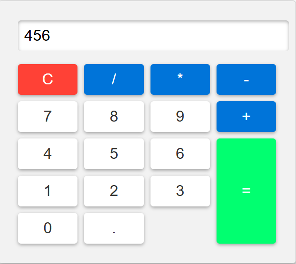

# 🧮 Basic Calculator

A clean and simple **Basic Calculator Web App** built using **HTML, CSS, and JavaScript**.  
This project performs basic arithmetic operations and is designed for beginners to understand DOM manipulation and event handling.

---

## ✨ Features

✅ Addition, Subtraction, Multiplication, Division  
✅ Real-time input display  
✅ Clear (C) button to reset  
✅ Responsive and beginner-friendly UI

---

## 🖥️ Project Preview




---

## 🛠️ Technologies Used

- 🧱 HTML5  
- 🎨 CSS3  
- ⚙️ JavaScript (DOM + Events)

---

## 📁 Project Structure

```

📦 basic-calculator
┣ 📂 images
┃ ┗ 🖼️ calculator.png
┣ 📄 index.html
┣ 📄 style.css
┗ 📄 script.js

```

---

## 🚀 How To Run This Project

1. Download or clone the repository  
2. Open `index.html` in your browser  
3. Start using the calculator 🎉

---
