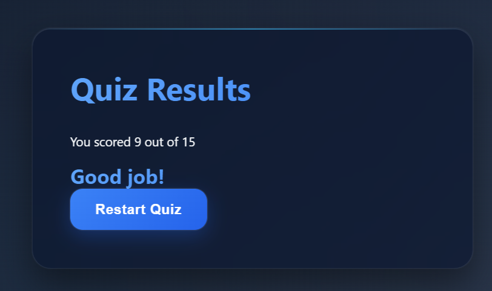
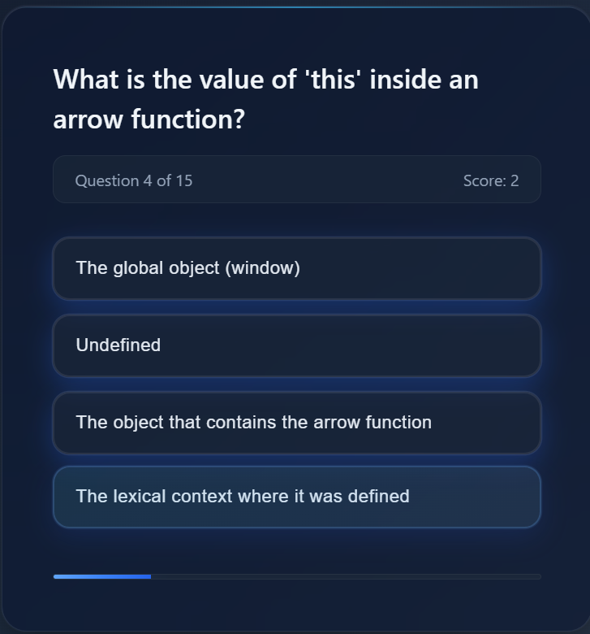
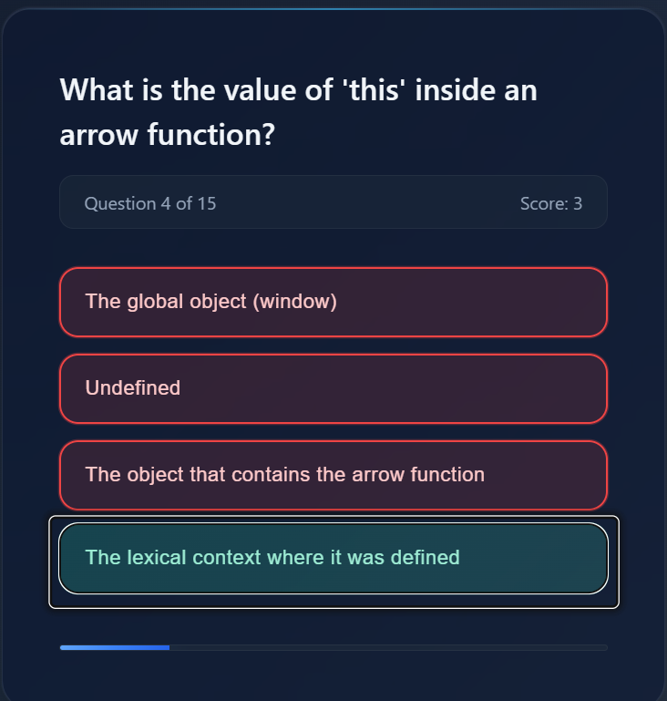
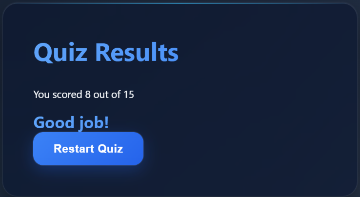

# 🎯 JavaScript Quiz Game

A modern, interactive **JavaScript Quiz Application** built using **HTML, CSS, and Vanilla JavaScript**.  
Designed with a glass-morphism UI, smooth animations, and real-time score tracking to deliver a clean and engaging quiz experience.

This project focuses on **core JavaScript concepts**, DOM manipulation, event handling, and state management — no frameworks, no shortcuts.

---

## 🚀 Features

- 🎬 Start, Quiz, and Result screens
- 📊 Real-time score tracking
- 📈 Animated progress bar
- ✅ Instant answer validation (correct / wrong)
- 🔁 Restart quiz functionality
- 💎 Modern glass-morphism UI with gradients
- 📱 Fully responsive design
- 🧠 JavaScript-focused MCQs (Easy → Hard)

---

## 🛠️ Tech Stack

- **HTML5** – Structure
- **CSS3** – Styling, animations, glass-morphism
- **JavaScript (ES6+)** – Logic and interactivity

---

## 📁 Project Structure

```
quiz-app/
│
├── index.html
├── style.css
├── script.js
├── images/
│   ├── img1.png
│   ├── img2.png
│   ├── img3.png
│   └── img4.png
└── README.md

````

---

## 🖼️ Screenshots

### 🔹 Start Screen


### 🔹 Quiz Question Screen


### 🔹 Answer Validation


### 🔹 Result Screen



---

## ⚙️ How to Run Locally

1. Clone the repository  
   ```bash
   git clone https://github.com/your-username/quiz-app.git
````

2. Navigate to the project folder

   ```bash
   cd quiz-app
   ```

3. Open `index.html` in your browser
   *(No server required)*

---
